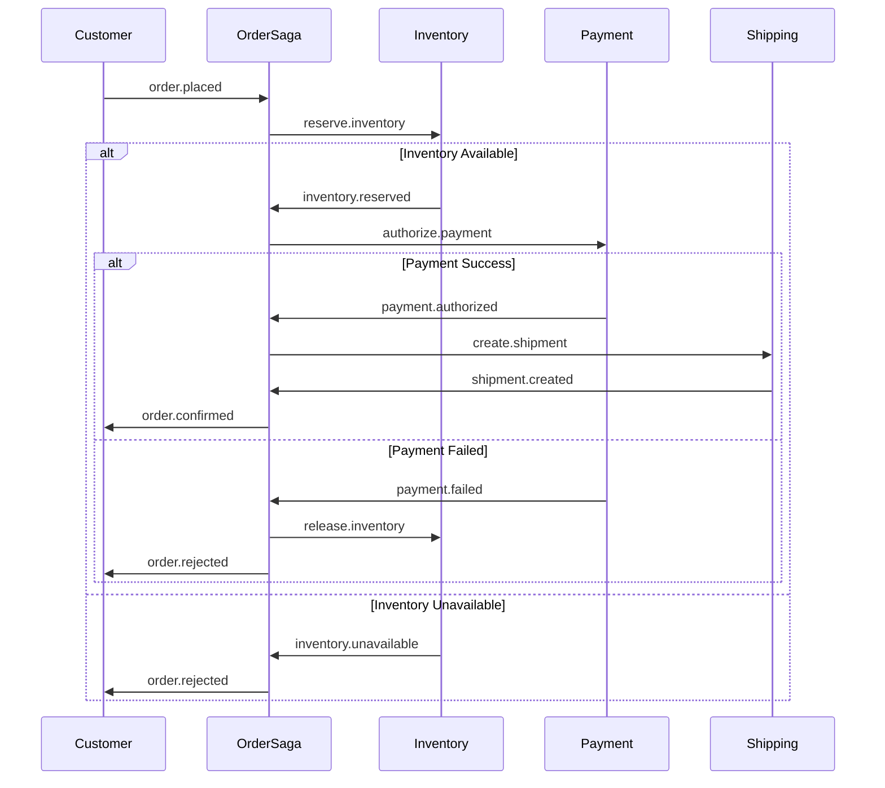

# Visualization & Exploration Features

Advanced visualization tools for understanding complex event-driven systems through diagrams, maps, and interactive explorations.

## Feature 7.1: Context Map Generator

### Description
Automatically generate Domain-Driven Design context maps from SpecKit bounded context templates, showing relationships between domains and services.

### Problem Statement
Understanding relationships between bounded contexts is critical for event-driven architecture, but manually creating and maintaining context maps is time-consuming.

### Key Capabilities

#### Auto-Generated Context Maps

From SpecKit DDD templates, generate visualizations showing:
- Bounded contexts
- Relationships (Shared Kernel, Customer/Supplier, Conformist, Anti-Corruption Layer, etc.)
- Event flows between contexts
- Team ownership

**Mermaid Diagram Output:**


**PlantUML Output:**
```plantuml
@startuml
!include https://raw.githubusercontent.com/plantuml-stdlib/C4-PlantUML/master/C4_Context.puml

System_Boundary(user, "User Management") {
    System(user_service, "User Service", "Manages user accounts and authentication")
}

System_Boundary(order, "Order Management") {
    System(order_service, "Order Service", "Handles order processing")
}

System_Boundary(payment, "Payment") {
    System(payment_service, "Payment Service", "Processes payments")
}

Rel(user_service, order_service, "user.registered", "Event")
Rel(order_service, payment_service, "order.placed", "Event")
Rel(payment_service, order_service, "payment.authorized", "Event")

@enduml
```

#### Relationship Types

```yaml
# specs/context-relationships.yml

relationships:
  - from: user-management
    to: order-management
    type: customer-supplier
    events:
      - user.registered
      - user.verified
    description: Order service consumes user events

  - from: order-management
    to: payment
    type: partnership
    events:
      - order.placed (downstream)
      - payment.authorized (upstream)
    description: Bidirectional event flow

  - from: legacy-crm
    to: user-management
    type: anti-corruption-layer
    description: ACL translates legacy user format
```

#### Interactive HTML Export

```html
<!-- Generated interactive context map -->
<!DOCTYPE html>
<html>
<head>
  <title>Event-Driven Architecture Context Map</title>
  <script src="https://cdn.jsdelivr.net/npm/d3@7"></script>
</head>
<body>
  <div id="context-map"></div>
  <script>
    // Interactive D3.js visualization
    // - Click contexts to see details
    // - Hover events to see payload
    // - Filter by domain/team
  </script>
</body>
</html>
```

### Usage
```bash
/speckit.visualize context-map
→ Scans DDD bounded context templates
→ Extracts relationships from domain events
→ Generates Mermaid, PlantUML, and interactive HTML
→ Exports to EventCatalog
```

### Priority
**Tier 2** - Valuable for understanding system architecture.

---

## Feature 7.2: Event Flow Visualizer

### Description
Visualize event flows through the system, showing choreography patterns, saga orchestrations, and event chains.

### Problem Statement
Understanding how events flow through a complex distributed system is difficult without visual representations.

### Key Capabilities

#### Sequence Diagram Generation

**User Registration Flow:**


**Order Fulfillment Saga:**


#### Event Chain Viewer

```
Event Chain: User Registration to First Purchase
================================================

1. user.registered
   ↓ (triggers: email-service, analytics-service)
   ├─→ 2a. email.verification.sent
   └─→ 2b. user.profile.created

2a. email.verification.sent
   ↓ (user clicks link)
   └─→ 3. email.verified

3. email.verified
   ↓ (triggers: user-service)
   └─→ 4. user.activated

4. user.activated
   ↓ (triggers: marketing-service)
   └─→ 5. welcome.email.sent

[... user browses products ...]

6. product.added.to.cart
   ↓
   └─→ 7. cart.updated

7. order.placed
   ↓ (triggers: order-saga)
   ├─→ 8a. inventory.reserved
   ├─→ 8b. payment.authorized
   └─→ 8c. shipment.created
       ↓
       └─→ 9. order.confirmed
```

#### Critical Path Analysis

```
Critical Path: Order to Shipment
=================================

Total Duration: 2.3 seconds (average)

1. order.placed (0ms)
   ↓
2. inventory.reserved (+450ms) ⚠️ SLOW
   ↓
3. payment.authorized (+1200ms) ⚠️ SLOW
   ↓
4. shipment.created (+650ms)

Bottlenecks:
1. Payment authorization: 1200ms (52% of total time)
   Recommendation: Implement async payment with callback

2. Inventory reservation: 450ms (20% of total time)
   Recommendation: Cache inventory availability
```

### Usage
```bash
/speckit.visualize event-flow user-registration
→ Analyzes event flow from specs
→ Generates sequence diagrams
→ Identifies critical paths
→ Exports to EventCatalog
```

### Priority
**Tier 2** - High value for understanding system behavior.

---

## Feature 7.3: Event Timeline Viewer

### Description
Chronological visualization of events in a workflow, with correlation tracking and causation chains for debugging.

### Problem Statement
Debugging distributed transactions requires understanding the temporal relationships between events, which is difficult with traditional logging.

### Key Capabilities

#### Timeline Visualization

```
Event Timeline: Order #12345
=============================
Time: 2025-11-07 14:30:00 - 14:30:15 (15 seconds)

14:30:00.000 ● order.placed
             │  orderId: 12345
             │  customerId: 789
             │  total: $150.00
             │
14:30:00.120 ├─● inventory.check.requested
             │  correlation: order-12345
             │
14:30:00.450 ├─● inventory.reserved
             │  correlation: order-12345
             │  items: [101, 102]
             │
14:30:00.500 ├─● payment.authorization.requested
             │  correlation: order-12345
             │  amount: $150.00
             │
14:30:01.700 ├─● payment.authorized ⚠️ SLOW (1.2s)
             │  correlation: order-12345
             │  transactionId: txn-abc
             │
14:30:01.750 ├─● shipping.requested
             │  correlation: order-12345
             │
14:30:02.400 ├─● shipment.created
             │  correlation: order-12345
             │  trackingNumber: TRACK123
             │
14:30:02.450 └─● order.confirmed
                correlation: order-12345
                confirmationId: CONF-12345

Duration: 2.45 seconds
Events: 8
⚠️ Slow operations: payment.authorized (1.2s)
```

#### Correlation Tracking

```typescript
// Auto-inject correlation tracking

interface EventMetadata {
  eventId: string;
  correlationId: string;  // Tracks related events
  causationId: string;    // Tracks what caused this event
  timestamp: number;
}

// Example event chain
{
  eventId: "evt-001",
  correlationId: "order-12345",
  causationId: null,  // Root event
  type: "order.placed"
}
↓
{
  eventId: "evt-002",
  correlationId: "order-12345",  // Same correlation
  causationId: "evt-001",        // Caused by order.placed
  type: "inventory.reserved"
}
```

#### Filtering & Search

```bash
# Filter timeline by aggregate
speckit timeline --aggregate order-12345

# Filter by event type
speckit timeline --event-type "payment.*"

# Filter by time range
speckit timeline --from "2025-11-07 14:00" --to "2025-11-07 15:00"

# Find slow operations
speckit timeline --min-duration 1000  # > 1 second
```

#### Export Formats

```bash
# Export as JSON
speckit timeline order-12345 --format json > timeline.json

# Export as Markdown
speckit timeline order-12345 --format markdown > timeline.md

# Export as Jaeger trace
speckit timeline order-12345 --format jaeger > trace.json
```

### Usage
```bash
/speckit.timeline order-12345
→ Retrieves all correlated events
→ Sorts chronologically
→ Identifies causation chains
→ Highlights slow operations
```

### Priority
**Tier 2** - Valuable for debugging and operational visibility.

---

## Related Features
- **Feature 1.1:** EventCatalog Generator (exports visualizations)
- **Feature 3.2:** Saga Pattern Generator (generates flow diagrams)
- **Feature 9.2:** Event Telemetry (provides timing data for visualizations)

## Resources
- [Mermaid Diagrams](https://mermaid.js.org/)
- [PlantUML](https://plantuml.com/)
- [D3.js Visualizations](https://d3js.org/)
- [DDD Context Mapping](https://github.com/ddd-crew/context-mapping)
